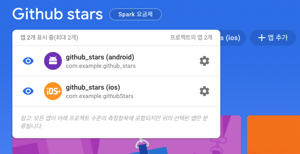

# Github stars 앱
### Firebase 프로젝트 생성
---
* [Firebase](https://firebase.google.com/) 접속 -> 시작하기 -> 프로젝트 만들기
* 프로젝트 이름을 지정 : Github stars
* Google analytics : OFF
* Flutter 프로젝트에서 Firebase 사용 가능하도록 설정
    * Flutter 앱 선택

<br>

### Firebase CLI 설정
---
* 설치 방법 : [Firebase CLI 참조 | Firebase Documentation](https://firebase.google.com/docs/cli?authuser=0&hl=ko)
```bash
# Firebase CLI 설치
curl -sL https://firebase.tools | bash

# Firebase 로그인
firebase login

# Firebase CLI 테스트
firebase projects:list
```

<br>

### FlutterFire CLI 설정
---

```bash
# FlutterFire CLI 설치
dart pub global activate flutterfire_cli

vi ~/.zshrc

export PATH="$PATH":"$HOME/.pub-cache/bin"

source ~/zshrc

# Firebase Flutter 프로젝트 등록
cd github_stars

flutterfire configure --project=github-stars-a4179
```

* 설정 원하는 플랫폼 선택 후 Enter
* 정상 설정 시 `lib/firebase_options.dart` 파일이 생성
* Firebase 프로젝트에 선택한 플랫폼 앱이 생성된 것을 확인



<br>

### 프로젝트에 Firebase 설정
---
* `pub spec.yml`에 `firebase_core` 패키지 추가
```yaml
dependencies:
  firebase_core: ^1.19.1
```

<br>

* `main.dart`에 아래 코드 추가
```dart
import 'package:firebase_core/firebase_core.dart';
import 'package:github_stars/firebase_options.dart';

void main() async {
  await Firebase.initializeApp(
    options: DefaultFirebaseOptions.currentPlatform,
  );
}
```

<br>

### Github에서 OAuth 앱 등록
---
* Github -> Settings -> Developer settings -> OAuth Apps -> Register a new application
    * Application Name : 깃헛스타
    * Homepage Url : [GitHub - saturday-night-study/github_stars](https://github.com/saturday-night-study/github_stars)
    * Callback URL : https://github-stars-a4179.firebaseapp.com/__/auth/handler
        * Callback URL은 Authentication 설정 페이지에서 조회
        
<br>

### Authentication 설정
---
* 프로젝트 -> Authentication -> 시작하기 -> Github
* 사용 설정 : ON
* Client ID, Client Secret은 Github OAuth 앱 상세에서 확인

<br>

### Github 계정 연동
---
* `firebase_auth, github_sign_in` 패키지 설치
```yaml
dependencies:
  firebase_auth: ^3.4.1
  github_sign_in: ^0.0.5-dev.4
```

* 깃헛 OAuth 인증 샘플 코드 : https://firebase.flutter.dev/docs/auth/social/#github
